<h1 align="center">Hi there, I'm Sohan Kanna  👋</h1>
<h3 align="center">A CSE Student passionate about Offensive Security and Defensive Operations.</h3>

---

As a Computer Science student, I'm fascinated by the constant duel between system exploitation and protection. This curiosity drives my hands-on work, from building defensive SIEM labs to analyzing attacker tools and deconstructing threats in CTFs. I leverage my understanding of how systems are built to better understand how they break. I am actively seeking roles in SOC analysis or penetration testing where I can apply my analytical skills to real-world security challenges.

- 🔭 I’m currently analyzing new malware samples and documenting my findings on my **Medium blog**.
- 🎯 Currently pursuing **CPTS (Hack The Box)** and **SC-500: Cloud and AI Security Engineer Associate (Microsoft)**.
- 🌱 I’m always active on platforms like **TryHackMe** and **LetsDefend** to sharpen my offensive and defensive skills.
- 💬 Ask me about **Malware Analysis, Reverse Engineering (Ghidra), SIEM architecture, or CTFs!**
- 📫 The best way to reach me is through **<a href="https://www.linkedin.com/in/sohan-kanna/">LinkedIn</a>**.

---

## 🏆 Security Hall of Fame & Responsible Disclosure

I actively hunt for and responsibly report security vulnerabilities. My findings have been acknowledged by:

-   🏈 **NFL** — Security Hall of Fame
-   💡 **Philips** — Security Hall of Fame
-   🖥️ **IBM** — Security Hall of Fame
-   🌐 **United Nations** — vulnerability triaged _(Hall of Fame listing pending)_

---

### 🛡️ My Cybersecurity & Technical Skillset

  
<strong>👨‍💻 Programming & Scripting Languages</strong>

   
  

    
    
    
    
    
    
  

  
<strong>🛡️ Cybersecurity Domains</strong>

   
  

    -   Malware Analysis & Reverse Engineering: Static/Dynamic Analysis, Deobfuscation, Disassemblers
      
    -   Security Operations (SecOps): SIEM/EDR, Log Analysis, Incident Response
      
    -   Application Security (AppSec): OWASP Top 10, Vulnerability Assessment
      
    -   Offensive Security: Web/API Pentesting, Phishing Simulations, Social Engineering
      
  

  
<strong>⚙️ Tools & Platforms</strong>

   
  

    
    
    
    
    
    
    
    
  

---

### 💼 Experience

  <strong>Security Intern</strong> — BytesEncrypt 
  Designed and built an end-to-end blue-team security-training platform (Node.js, AWS), authoring 40–50 hands-on defensive-security labs covering threat detection, log analysis, and incident response.

  <strong>Technical Lead</strong> — ZeroCrypt (Cybersecurity Club) 
  Architected distributed lab infrastructure (Docker, AWS) for cybersecurity simulations and conducted hands-on workshops for 40+ students.

  <strong>Security Consultant (Freelance)</strong> 
  Identified and reported critical and high-severity vulnerabilities across SaaS applications, mapped to the OWASP Top 10.

---

## 📜 Certifications

> 🎯 **In progress:** CPTS (Hack The Box) · SC-500 Cloud and AI Security Engineer Associate (Microsoft)

  
<strong>Hack The Box (HTB)</strong>

   

  _This section contains my certifications from Hack The Box._

  <h4>Certified Defensive Security Analyst (CDSA)</h4>
  
    

  <h4>CJCA</h4>
  
    

  
<strong>TryHackMe</strong>

   

  _This section contains all my certifications from TryHackMe._

  <h4>SOC Level 1 (Learning Path)</h4>
  
    

  <h4>Jr Penetration Tester</h4>
  <a href="">
    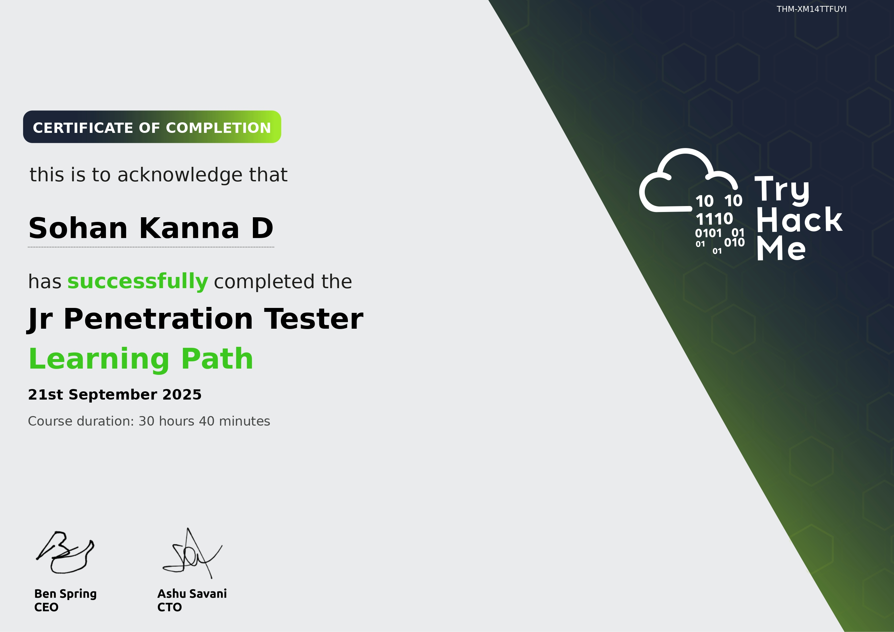
  </a>
    

  <h4>CyberSecurity Fundamentals</h4>
  <a href="">
    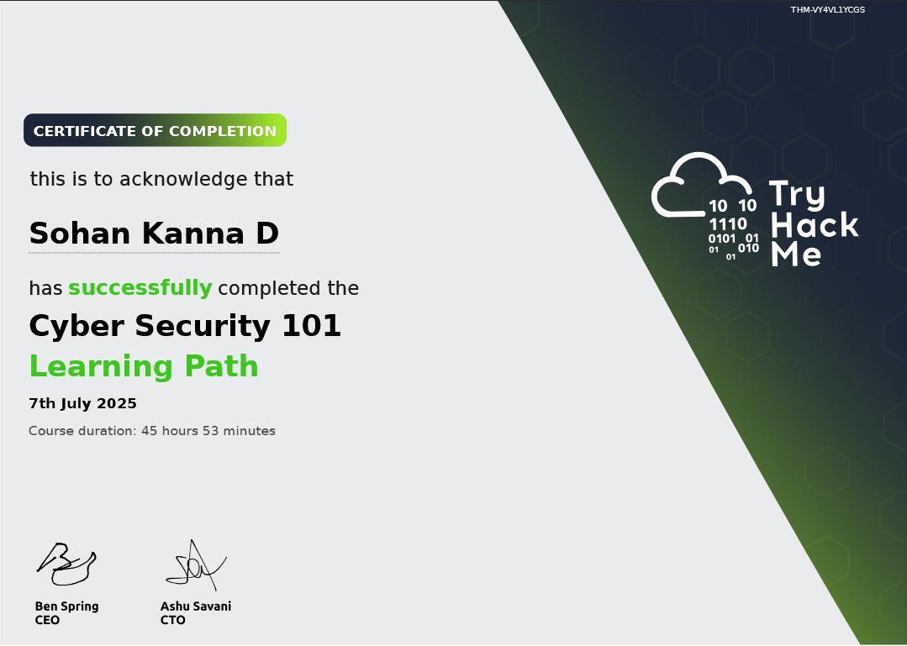
  </a>
    

  <h4>Web Fundamentals</h4>
  <a href="">
    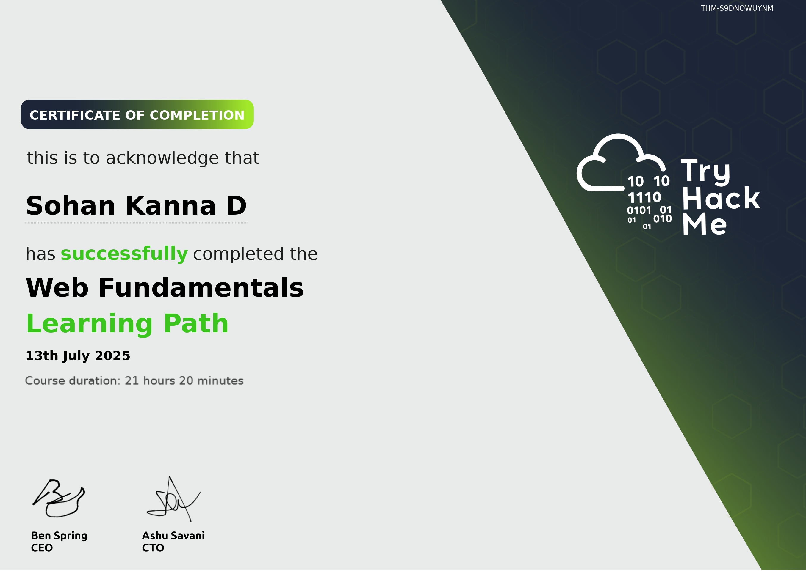
  </a>
    

  
<strong>LetsDefend</strong>

   

  _This section contains my certificates of completion from the LetsDefend platform._

  <h4>SOC Analyst Fundamentals</h4>
  <a href="https://app.letsdefend.io/certificate/show/7f970376-3faf-4673-aa48-db46b81a847e">
    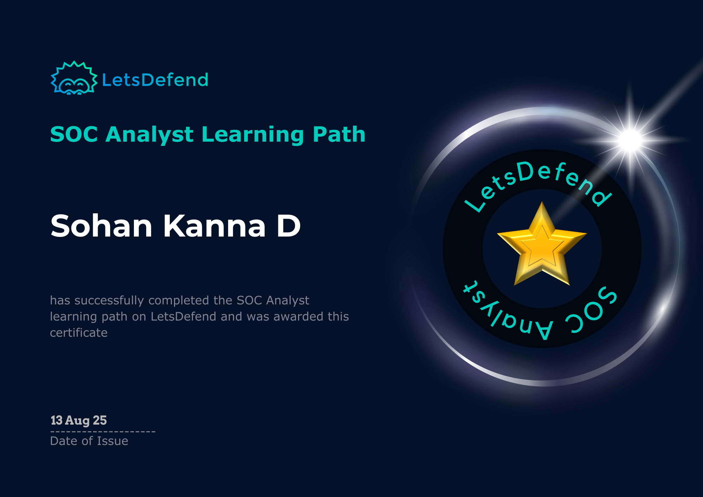
  </a>
    

  <h4>Malware Analysis</h4>
  <a href="https://app.letsdefend.io/certificate/show/c0d346a1-d7da-4ee1-8c3a-bd445f6273eb">
    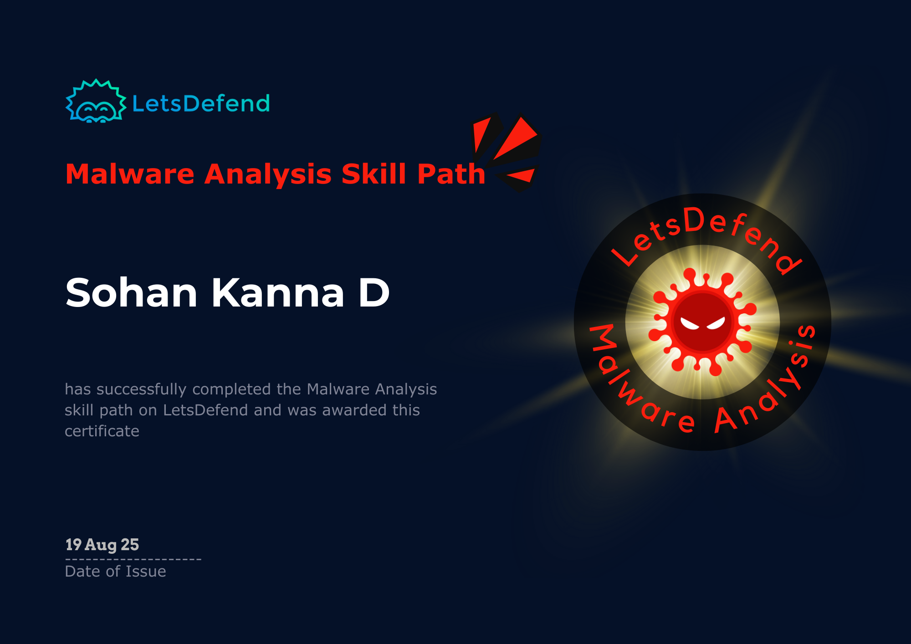
  </a>
    

  <h4>Web Attack Detection and Analysis</h4>
  <a href="https://app.letsdefend.io/certificate/show/fd7c977e-6f79-4842-85bf-43641389f230">
    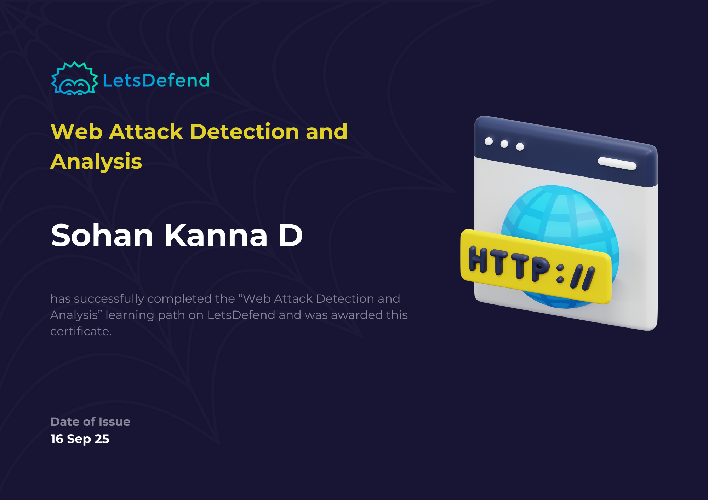
  </a>
    

  <h4>Programming For CyberSecurity</h4>
  <a href="https://app.letsdefend.io/certificate/show/06d1ae83-cf3b-4189-96e2-f498de03a109">
    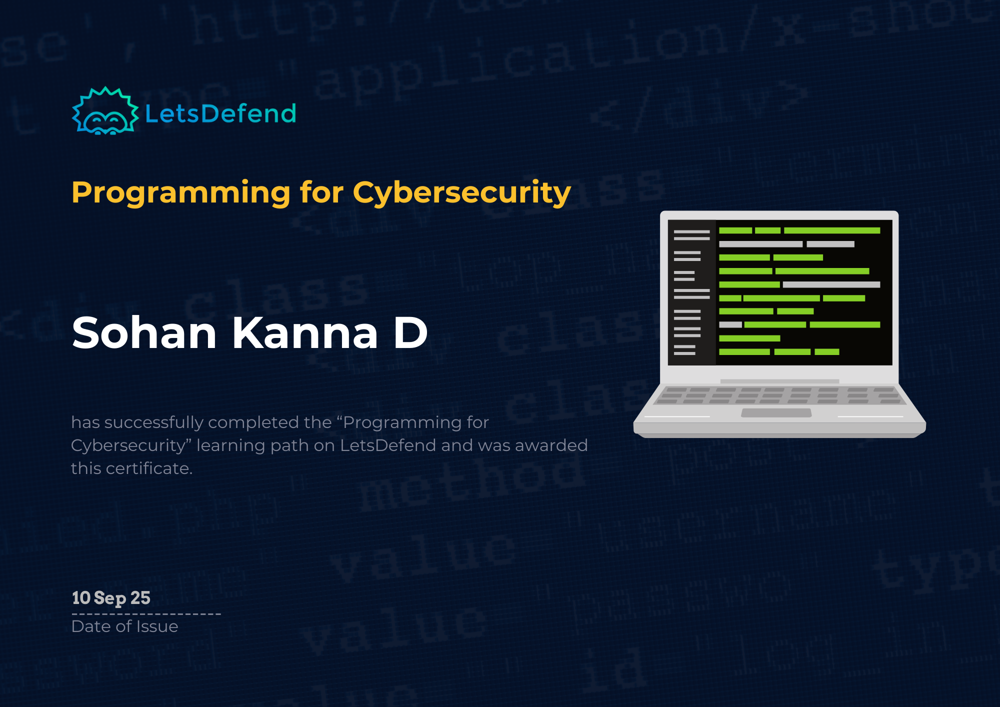
  </a>
    

  <h4>Non Stop</h4>
  <a href="https://app.letsdefend.io/my-rewards/detail/a3cccbd1-5060-40e8-9722-6ca17c212a03">
    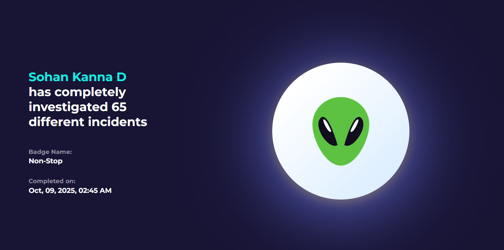
  </a>
    

  <h4>Hunter - 2 Badge</h4>
  <a href="https://app.letsdefend.io/my-rewards/detail/b88c01b5cb0c4776b4437d7a7765a5f0">
    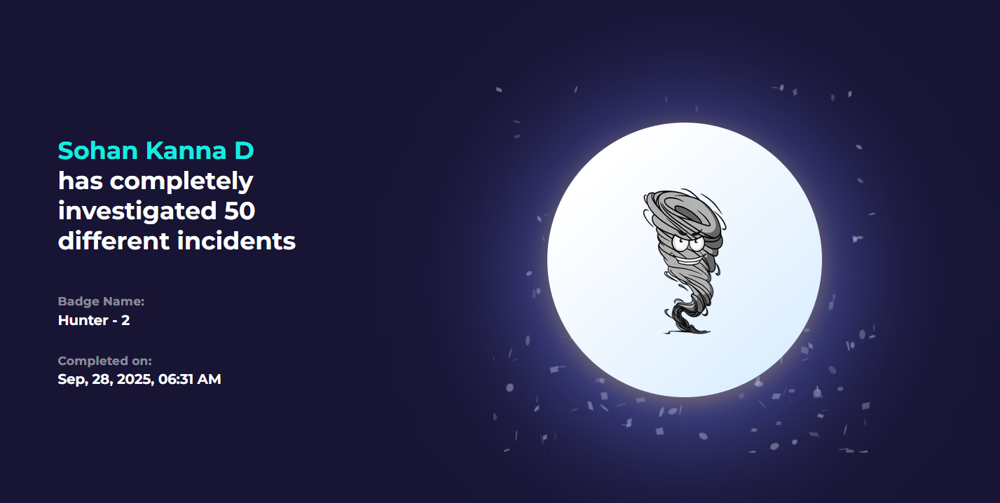
  </a>
    

  <h4>Hunter Badge</h4>
  
    

  
<strong>(ISC)²</strong>

   

  <h4>(ISC)² Certified in Cybersecurity (CC)</h4>
  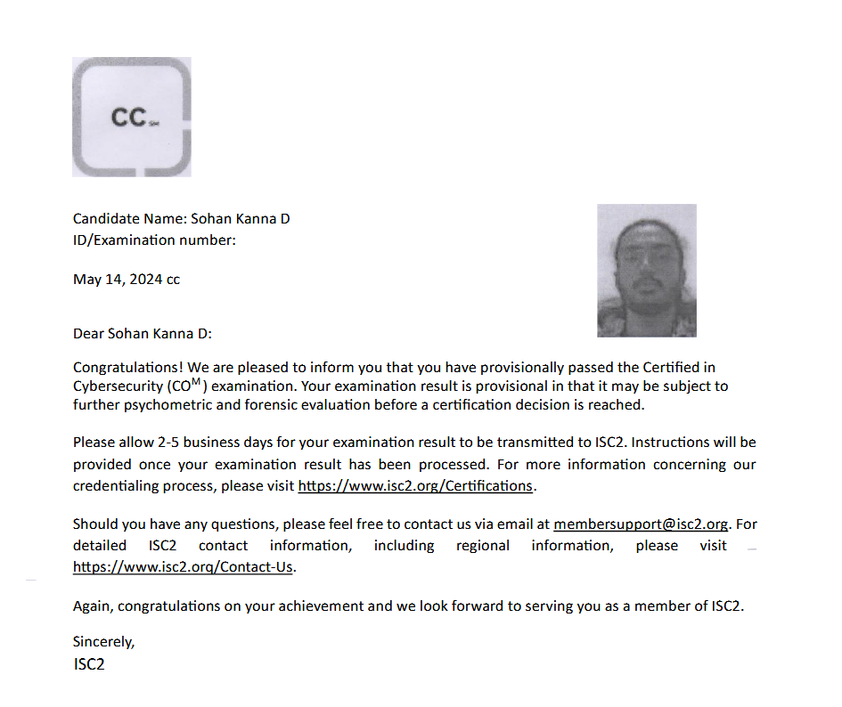
    

  
<strong>NPTEL (IIT Bombay)</strong>

   

  <h4>Network Security</h4>
  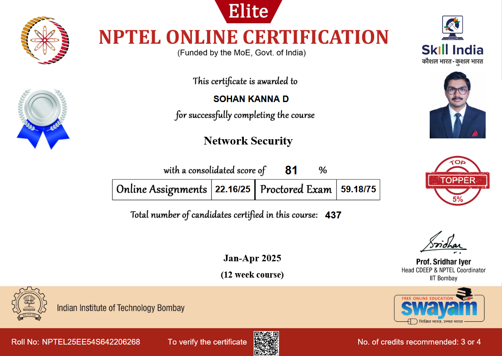
    

  
<strong>Google</strong>

   

  <h4>Google Cybersecurity Professional Certificate</h4>
  <a href="https://www.coursera.org/account/accomplishments/specialization/C9Z75MHGWLCQ">
    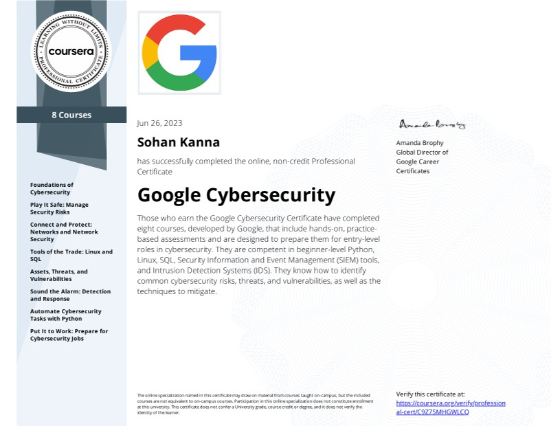
  </a>
    

---

### ✍️ My Writing & Analysis

I regularly publish in-depth articles on malware analysis, reverse engineering, and decoding heavily obfuscated code — including a piece on Chrome zero-day exploitation that reached **6,000+ reads**. You can find my work on Medium.

  

---

### 🚀 My Projects & Hands-On Work

<!-- Project 1: SIEM Lab -->

  <strong><a href="https://github.com/sohankanna/Wazuh-SOC-Lab">Automated SIEM & EDR Lab with Wazuh</a></strong> 
  Designed and built a fully functional Security Information and Event Management (SIEM) lab from the ground up. This project uses Wazuh to provide EDR capabilities, centralizing log collection and security monitoring for multiple endpoints to detect simulated attacks.
   
  <em>Technologies: Wazuh, Elastic Stack (ELK), VirtualBox, Linux, Python</em>

<!-- Project 2: Phishing Tool -->

  <strong><a href="https://github.com/sohankanna/PhishingSimulator/blob/main/README.md">Phishing Campaign Simulator</a></strong> 
  A Python-based tool developed to conduct controlled phishing simulations for security awareness training. The application sends customized email templates and hosts a tracking server to measure campaign effectiveness.
   
  <em>Technologies: Python, SMTP, Django, HTML/CSS</em>

<!-- Project 3: Write-ups -->

  <strong><a href="https://github.com/sohankanna/cybersecurity-writeups/tree/main">Security Challenges & SOC Alert Analysis Write-ups</a></strong> 
  All my detailed walkthroughs for TryHackMe labs, CTF Challenges and my analysis of real-world SOC alerts from the LetsDefend platform, documenting my approach to both offensive and defensive security challenges.
   
  <em>Domains: Digital Forensics, Incident Response (DFIR), Penetration Testing, Log Analysis</em>

---

## 🏆 CTF Competitions & Achievements

I am passionate about sharpening my skills through competitive cybersecurity. I actively participate in Capture The Flag (CTF) events with my team, **Diamond_Dogs**. I maintain a repository to document this journey:

-   **[🏆 CTF Trophy Case](https://github.com/sohankanna/ctf-trophy-case)**: A logbook of all the events I've participated in, showcasing my rankings, scores, and certificates of participation.

---

### 📬 Let's Connect

  
  

