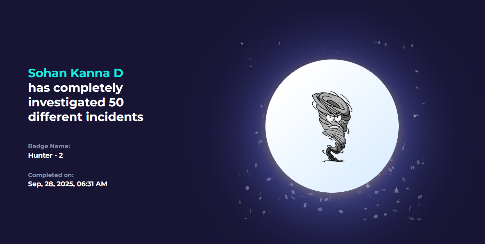
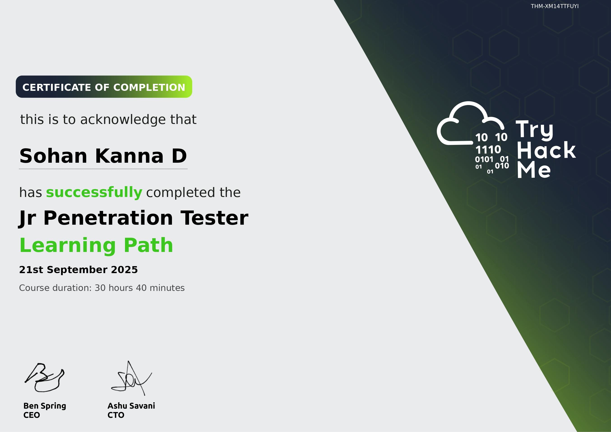

<h1 align="center">Hi there, I'm Sohan Kanna  👋</h1>
<h3 align="center">A CSE Student passionate about Offensive Security and Defensive Operations.</h3>

---

As a Computer Science student, I'm fascinated by the constant duel between system exploitation and protection. This curiosity drives my hands-on work, from building defensive SIEM labs to analyzing attacker tools and deconstructing threats in CTFs. I leverage my understanding of how systems are built to better understand how they break. I am actively seeking roles in SOC analysis or penetration testing where I can apply my analytical skills to real-world security challenges. 

- 🔭 I’m currently analyzing new malware samples and documenting my findings on my **Medium blog**.
- 🌱 I’m always active on platforms like **TryHackMe** and **LetsDefend** to sharpen my offensive and defensive skills.
- 💬 Ask me about **Malware Analysis, Reverse Engineering (Ghidra), SIEM architecture, or CTFs!**
- 📫 The best way to reach me is through **<a href="https://www.linkedin.com/in/sohan-kanna/">LinkedIn</a>**.

---

### 🛡️ My Cybersecurity & Technical Skillset

  
<strong>👨‍💻 Programming & Scripting Languages</strong>

   
  

    
    
    
    
  

  
<strong>🛡️ Cybersecurity Domains</strong>

   
  

    -   Malware Analysis & Reverse Engineering: Static/Dynamic Analysis, Deobfuscation, Disassemblers
      
    -   Security Operations (SecOps): SIEM/EDR, Log Analysis, Incident Response
      
    -   Application Security (AppSec): OWASP Top 10, Vulnerability Assessment
      
    -   Offensive Security: Phishing Simulations, Social Engineering
      
  

  
<strong>⚙️ Tools & Platforms</strong>

   
  

    
    
    
    
    
    
  

---

## 📜 Certifications

  
<strong>Google</strong>

   
  
  _This section contains all my certifications from Google._
  
  <h4>Google Cybersecurity Professional Certificate</h4>
  
    
  
  <!-- If you have another Google cert, add it here like the one above -->
  

  
<strong>(ISC)²</strong>

   
  
  <h4>(ISC)² Certified in Cybersecurity (CC)</h4>
  
  
 
    
  

  
<strong>LetsDefend</strong>

   
  
  _This section contains my certificates of completion from the LetsDefend platform._
  
  <h4>SOC Analyst Fundamentals</h4>
  
    

  <h4>Malware Analysis</h4>
  
    
    <h4>Web Attack Detection and Analysis</h4>
  
    

  <h4>Programming For CyberSecurity</h4>
  
      
    <h4>Non Stop</h4>
  
    
    
    <h4>Hunter - 2 Badge</h4>
  
    
  
    
    <h4>Hunter Badge</h4>
  
    

  
<strong>TryHackMe</strong>

   
  
  _This section contains all my certifications from TryHackMe._

  <h4>Jr Penetration Tester</h4>
  
    
  
  <h4>CyberSecurity Fundamentals</h4>
  
    
  <h4>Web Fundamentals</h4>
  
    
  

  
<strong>NPTEL (IIT Bombay)</strong>

   
  
  <h4>Network Security</h4>
  <!-- You might not have a public link, but you can still show the image -->
  
    
  

---

### ✍️ My Writing & Analysis

I regularly publish in-depth articles on malware analysis, reverse engineering, and decoding heavily obfuscated code. You can find my work on Medium.

  

---

### 🚀 My Projects & Hands-On Work

<!-- Project 1: SIEM Lab -->

  <strong><a href="https://github.com/sohankanna/Wazuh-SOC-Lab">Automated SIEM & EDR Lab with Wazuh</a></strong> 
  Designed and built a fully functional Security Information and Event Management (SIEM) lab from the ground up. This project uses Wazuh to provide EDR capabilities, centralizing log collection and security monitoring for multiple endpoints to detect simulated attacks.
   
  <em>Technologies: Wazuh, Elastic Stack (ELK), VirtualBox, Linux, Python</em>

<!-- Project 2: Phishing Tool -->

  <strong><a href="https://github.com/sohankanna/PhishingSimulator/blob/main/README.md">Phishing Campaign Simulator</a></strong> 
  A Python-based tool developed to conduct controlled phishing simulations for security awareness training. The application sends customized email templates and hosts a tracking server to measure campaign effectiveness.
   
  <em>Technologies: Python, SMTP, Django, HTML/CSS</em>

<!-- Project 3: Write-ups -->

  <strong><a href="https://github.com/sohankanna/cybersecurity-writeups/tree/main">Security Challenges & SOC Alert Analysis Write-ups</a></strong> 
  All my detailed walkthroughs for TryHackMe labs, CTF Challenges and my analysis of real-world SOC alerts from the LetsDefend platform, documenting my approach to both offensive and defensive security challenges.
   
  <em>Domains: Digital Forensics, Incident Response (DFIR), Penetration Testing, Log Analysis</em>

---

---

## 🏆 CTF Competitions & Achievements

I am passionate about sharpening my skills through competitive cybersecurity. I actively participate in Capture The Flag (CTF) events with my team, **Diamond_Dogs**. I maintain a repository to document this journey:

-   **[🏆 CTF Trophy Case](https://github.com/sohankanna/ctf-trophy-case)**: A logbook of all the events I've participated in, showcasing my rankings, scores, and certificates of participation.
---

### 📬 Let's Connect

  

